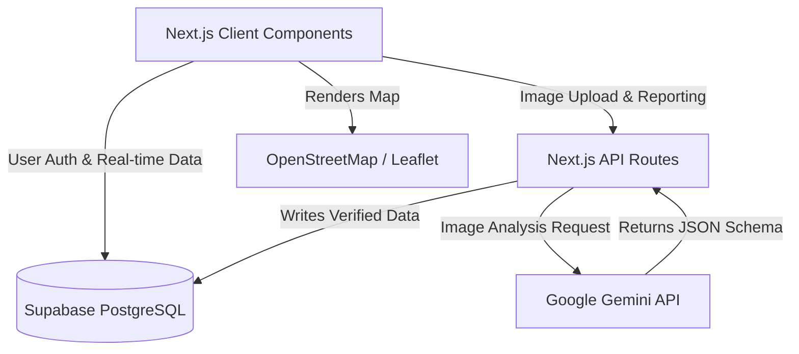

# System Design & Architecture

Civic Watch Hub is designed as a serverless, highly-available web application utilizing a modern React stack. 

## High-Level Architecture

## Data Flow: Issue Reporting
To ensure data integrity, the issue reporting flow is highly guarded:
1. **Client Action:** User selects a photo, enters a description, and uses the `MapPicker` to drop a pin.
2. **Metadata Extraction:** Before the image leaves the client, `exifr` runs to extract hidden EXIF GPS coordinates. 
3. **Anti-Spoofing Check:** If the EXIF coordinates exist, the client measures the distance to the user's dropped pin. If the distance > 100m, a warning is triggered.
4. **Server Analysis:** The image is sent to the `/api/analyze-image` route as base64 data.
5. **AI Processing:** Google Gemini analyzes the image and returns a strictly typed JSON object containing `category` and `severity`.
6. **Persistence:** The final payload (User ID, Image URL, AI classifications, Coordinates) is written to Supabase.

## Component Architecture
We employ a heavily compartmentalized React structure:
- **`MapPicker.tsx` & `LiveMap.tsx`**: Dynamic, client-only wrappers around React-Leaflet to avoid Next.js Server-Side Rendering (SSR) issues with `window`.
- **`DiscussionBoard.tsx`**: A real-time component that pulls and pushes comments to the `comments` table.
- **`ToastProvider.tsx`**: A global context for managing non-blocking user notifications.

## Gamification Engine
The gamification is handled intrinsically through the data layer:
- **Impact Score:** Derived dynamically (or updated via triggers) based on actions: `(+10 for Reporting, +5 for Verifying, -20 for False Disputes)`.
- **Hero Levels:** Calculated purely mathematically based on the total Impact Score on the client, avoiding database bloat.
